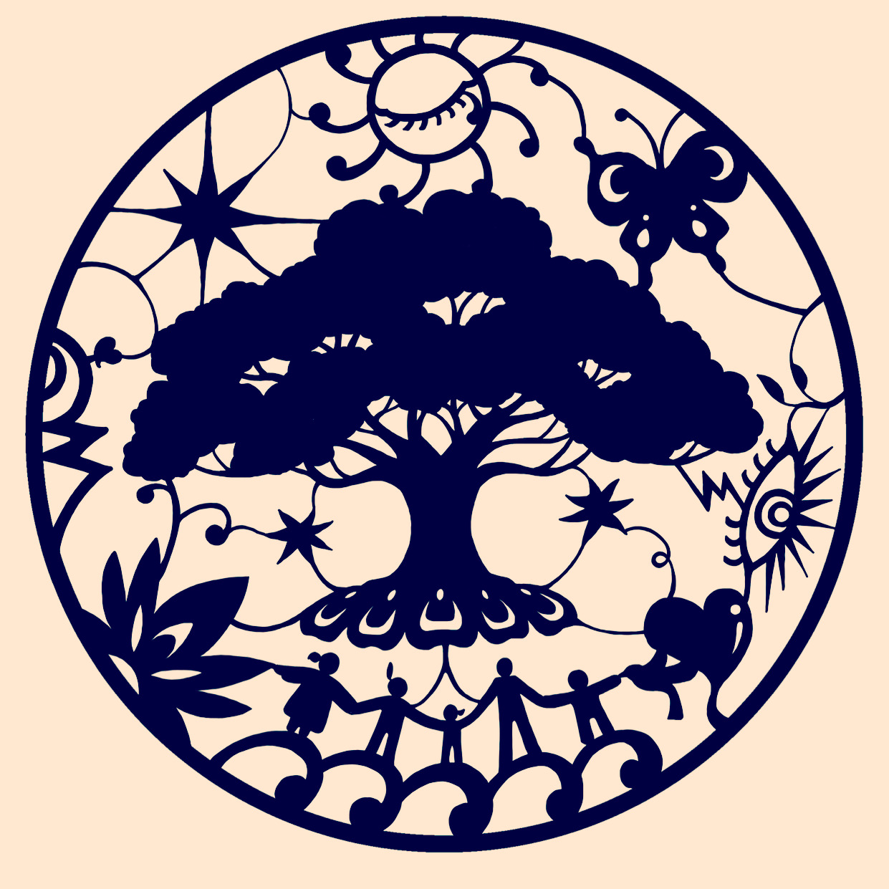

<h1 class="major"><b>PROJECT BIWOOM</b></h1>

!!! faq "BIWOOM PROJECT : 프로젝트 "비움" 이란? "

<b>PROJECT BIWOOM </b>  
프로젝트 "비움"은 불교지식의 보관과 전승을 위한 지혜인드라망 불교운동입니다.  
현재 세 종류의 프로젝트를 진행 중입니다.  
 
첫째. 웹기반의 정보저장소 <b>다르마노트</b>.   
둘째. 이타심과 지혜를 이야기와 그림으로 전하는 <b>그리다</b>. 
셋째. 모든 이들에게 명상수행의 기회를 제공하는 <b>열린선원</b>. 
 
대승적 불교신념의 기치 아래 이와같은 프로젝트 활동을 진행하며 오직 불교지식의 확장과 소통을 위해 활동하는 비영리활동입니다. 

---

??? abstract "지혜인드라망 LOGO"
    <figure>
    
    <figcaption>지혜인드라망</figcaption>
    </figure>

---

# __다르마노트__ Dharma Note 

__다르마노트__ : 불교지식 보관과 전승을 위한 지혜인드라망 정보저장소 

!!! tip "우리의 목표와 서원 "

!!! note ""
    LET WISDOM BE THE ONLY CURE

!!! note ""
    중생들 이끄시는 위없는 분이 많은 고행으로 얻은 소중한 가르침  
    어찌하면 널리 퍼질지 밤낮으로 살피게 하소서.

    모든 유정 어머님들 위없는 행복 얻게 하시고, 삼악도는 영원토록 비워지며,  
    보살님들 그 어디에 계시든 그분들 모두의 서원 원만히 이루어지게 하소서.

---

!!! attention ""
    __오직 법의 전승과 보존을 위하여 나아가라. 법의 기반 위에서만 모든 생명들, 부동의 안락을 누리기에. 그곳이 어디든, 냉혹한 설산의 깊은 산중일자라도, 이기의 아귀다툼 속 말세의 현장일지라도, 오직 법의 이익과 세존의 은혜를 되새기며 나아가라.__

{width=100%}

---