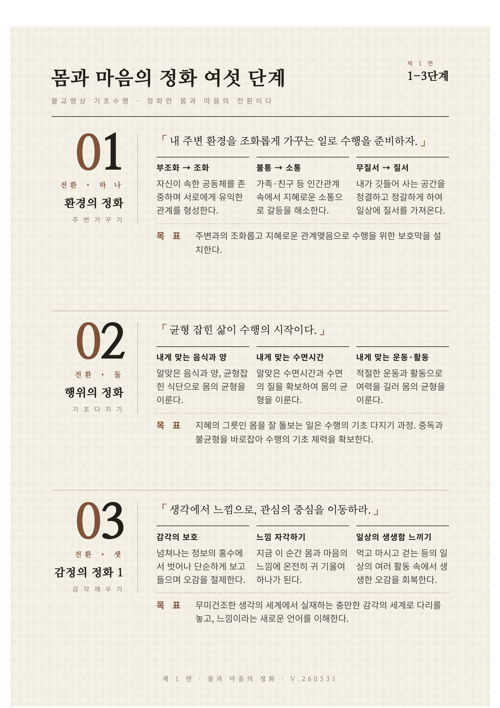
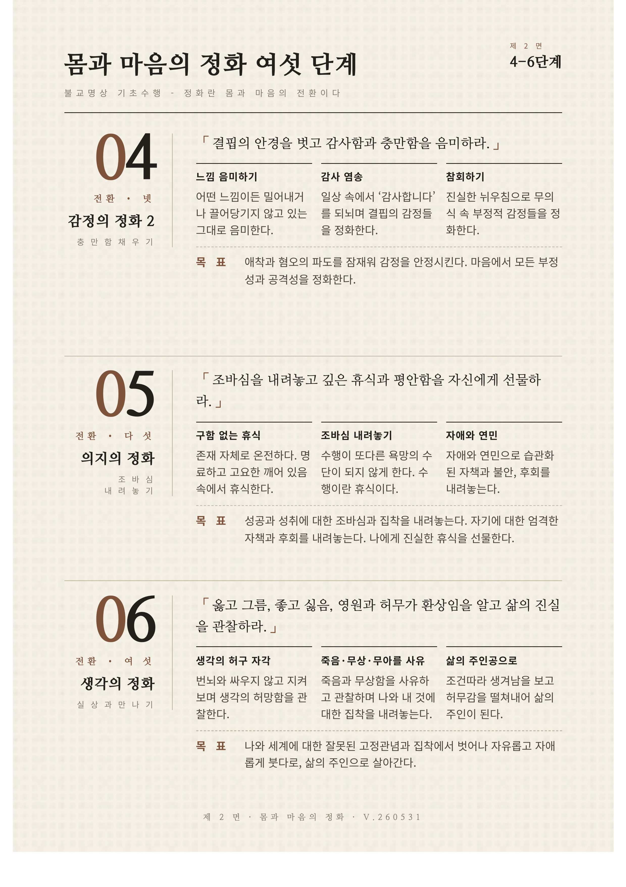

이번 인포그래픽은 `몸과 마음의 전환` 불교명상 기초수행을 강의와 실제 수행 지침에서 바로 쓸 수 있도록 정리한 자료다.

처음 문제의식은 단순했다. 불교 교리는 깊지만, 처음 접하는 사람에게는 너무 추상적으로 느껴질 수 있다. “생각의 허구를 본다”, “실상의 평안으로 나아간다”는 말은 중요하지만, 오늘 무엇을 해야 하는지로 바로 이어지지 않는다. 그래서 교리를 생활의 감각과 행위로 옮기는 도식이 필요했다.

## 여섯 단계로 나눈 이유

수행을 마음 하나의 문제로만 설명하면 몸과 생활이 빠진다. 반대로 생활 습관만 말하면 불교 수행의 방향이 흐려진다.

그래서 구조를 환경, 행위, 감정, 의지, 생각의 전환으로 나누었다.

1. 환경의 조화
2. 행위의 정화
3. 감정의 정화 1: 감각 깨우기
4. 감정의 정화 2: 충만함 채우기
5. 의지의 정화
6. 생각의 정화

이 순서는 바깥에서 안쪽으로, 거친 조건에서 미세한 조건으로 들어간다. 주변을 정돈하고, 먹고 자고 움직이는 행위를 균형 있게 만들고, 생각에서 느낌으로 내려온 뒤, 감사와 참회로 정서를 안정시킨다. 그 다음에야 조바심을 내려놓고, 마지막으로 생각의 허구성을 볼 수 있다.

## 제작 과정

시각 초안은 Claude Design을 사용했다. 다만 최종 자료는 자동 생성 결과를 그대로 둔 것이 아니라, 실제 수행 지침과 불교 강의용으로 쓰기 위해 단계명, 문구, 배치, 강조점을 직접 조정했다.

특히 신경 쓴 부분은 “예쁜 요약표”가 아니라 “수행자가 순서대로 따라갈 수 있는 안내문”이 되도록 만드는 것이었다. 각 단계에는 핵심 주제, 수행법, 목표가 들어가야 했다. 그래야 강사가 설명할 때도, 수행자가 혼자 읽을 때도 같은 흐름을 잡을 수 있다.

## 인포그래픽의 역할

이 자료는 완결된 논문이 아니라 입문 수행의 지도다. 명상프로그램에 이를 응용한다면 3박 4일 수행 일정에서는 첫날의 불교수행에 대한 간략한 이론적 이해를 익히고, 둘째 날은 환경과의 조화, 몸에 대한 균형, 정서적 치유의 전환, 셋째 날의 의지 정화와 인지 전환, 넷째 날의 총정리로 이어질 수 있다.

이 기초수행은 더 깊은 수행 예를들면 선정과 위빠사나와 같은 전문 수행으로 나아가기 전에 몸과 마음의 조건을 전환하는 보편적 입문 명상이다. 그렇지만 한 편으로 전문수행을 하는 동안에도 일상에서 몸과 마음의 균형을 유지하는 지침으로 계속 활용할 수 있다. 수행이 일상과 분리된 특별한 활동이 아니라, 일상 전체를 수행의 장으로 삼는 구조다.

## 정리

이번 인포그래픽의 핵심은 수행에 있어 너무 빨리 “깨달음”이라는 목표를 설정하거나 언급하지 않는 것이다. 주변을 정돈하고, 몸을 돌보고, 감각을 깨우고, 감사와 참회를 익히고, 구함 없는 휴식에 머물고, 그 바탕에서 생각의 허구성을 본다.

그렇게 할 때 추상적인 교리는 일상의 몸과 마음 안에서 실제 지침이 된다.
