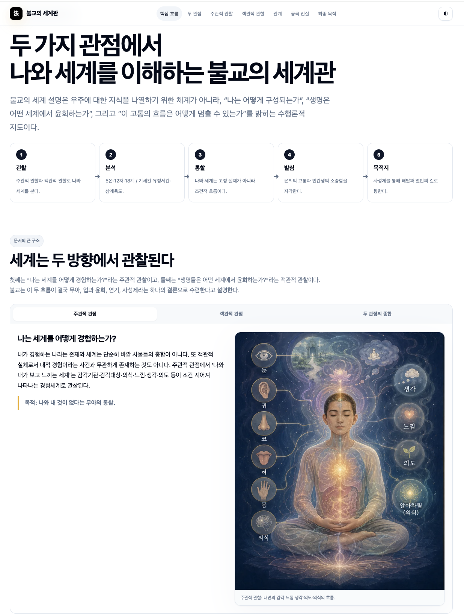

이 자료는 불교공부모임에서 나온 질문들에 답하는 과정에서 제작되었다.

불교의 세계관은 현대 과학의 관점에서 보면 비논리적이거나 비과학적으로 보일 수 있다. 삼계육도, 윤회, 업, 무아, 연기 같은 설명은 물리적 세계를 입자와 힘의 관계로 분석하는 방식과 목적이 다르기 때문이다.

그래서 이 인포그래픽의 핵심 질문은 “불교적 관찰은 무엇을 증명하려는가?”였다.

## 두 가지 관찰

자료는 불교의 세계관을 두 방향에서 정리한다.

첫째는 주관적 관찰이다. “나는 세계를 어떻게 경험하는가?”라는 질문에서 출발한다. 몸과 마음, 감각, 느낌, 생각, 의도, 의식을 분석하면 고정된 자아가 아니라 조건 지어진 경험의 흐름이 드러난다. 이 관찰의 결론은 무아다.

둘째는 객관적 관찰이다. “생명들은 어떤 세계에서 태어나고 머무르며 윤회하는가?”라는 질문이다. 여기서는 기세간, 유정세간, 삼계육도, 업과 윤회의 구조가 설명된다. 이 관찰은 세계를 물리적으로 측정하려는 것이 아니라, 조건 지어진 존재가 어떤 방식으로 고통의 장 안에 놓이는지를 보여준다.

## 목적은 우주론이 아니라 해탈이다

불교의 세계관은 우주가 물리적으로 어떻게 생겼는지를 최종적으로 설명하려는 체계가 아니다.

그 목적은 훨씬 실천적이다.

- 괴로움이 있다는 사실을 본다.
- 괴로움의 원인이 무명과 갈애와 업에 있음을 본다.
- 그 원인이 소멸될 수 있음을 본다.
- 소멸로 가는 길이 수행으로 열려 있음을 본다.

따라서 불교적 세계 설명은 사성제로 수렴한다. 세계를 설명하는 이유는 세계에 대한 호기심을 만족시키기 위해서가 아니라, 괴로움에서 벗어나는 길을 분명히 하기 위해서다.

## 정리

이 인포그래픽은 과학과 불교를 억지로 같은 언어로 맞추려는 자료가 아니다.

오히려 두 관점의 목적이 다르다는 점을 분명히 한다. 과학적 관찰이 물질세계의 구조와 작동 방식을 밝히는 데 강점이 있다면, 불교적 관찰은 경험, 집착, 고통, 윤회, 해탈의 문제를 밝히는 데 초점을 둔다.

불교의 세계관은 세계를 믿으라고 요구하기보다, “이 관찰이 무엇을 끊고 무엇을 가능하게 하는가”를 묻는다. 그 답은 무아, 연기, 사성제, 그리고 해탈과 열반의 길이다.

자료 보기: [불교의 세계관 — 두 가지 관점](/design/two-perspectives/)
