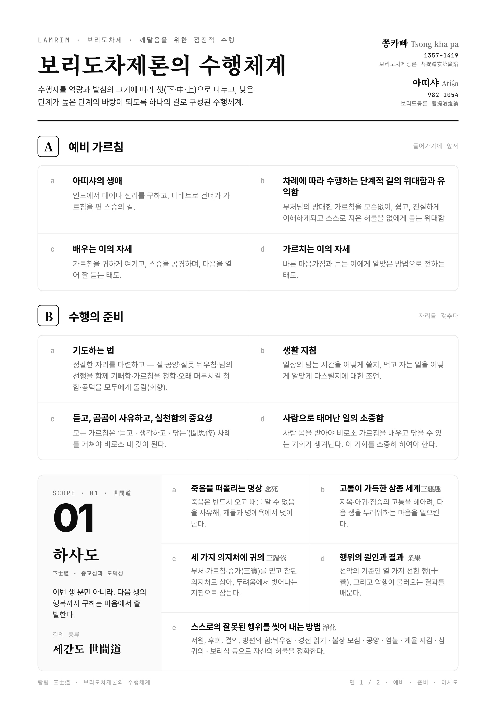
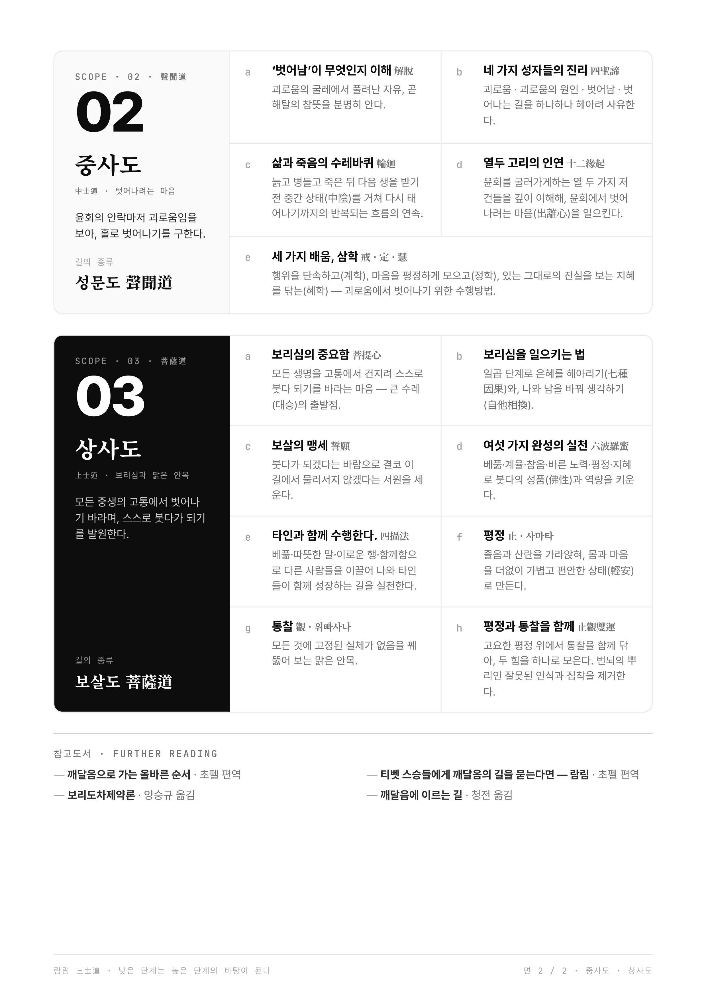

이번 인포그래픽은 보리도차제론의 수행체계를 강의에서 한눈에 설명하기 위한 자료다.

보리도차제론은 매우 체계적인 문헌이지만, 처음 듣는 사람에게는 하사도, 중사도, 상사도라는 이름만으로 수행의 흐름이 바로 잡히지 않을 수 있다. 그래서 각 단계가 어떤 마음을 만들고, 다음 단계와 어떻게 이어지는지 시각적으로 정리할 필요가 있었다.

## 제작 동기

이 자료의 핵심 질문은 “람림을 어떻게 오늘의 강의 언어로 보여줄 것인가”였다.

보리도차제론은 단순한 이론서가 아니라 수행자의 마음을 순서대로 길들이는 체계다. 하사도는 종교심과 도덕성을 세우고, 중사도는 출리심을 세우며, 상사도는 보리심과 청정견으로 나아간다. 중요한 것은 이 순서다. 앞 단계가 체화되지 않으면 다음 단계가 안정적으로 서지 않는다.

그래서 인포그래픽에는 단계의 이름만 넣는 것으로 충분하지 않았다. 각 단계의 마음, 수행 주제, 다음 단계로 넘어가는 이유가 함께 보여야 했다.

## 신해도·귀의도·출리도·보리도

제작 과정에서 보리도차제론의 삼사도 구조를 다음 네 길로 다시 읽었다.

- 신해도: 준비하는 길, 지도 만들기
- 귀의도: 두 발로 서는 길, 기초 세우기
- 출리도: 자유의 길, 타고난 순수함 회복하기
- 보리도: 이타의 길, 지혜로 세계를 꾸미기

이 네 표현은 원래 구조를 대체하려는 것이 아니라, 강의와 수행 지도에서 더 직관적으로 사용할 수 있도록 돕는 언어다. 신해도는 법에 대한 믿음과 이해를 세우고, 귀의도는 죽음과 인과를 사유하며 삼보에 의지한다. 출리도는 윤회의 고통에서 벗어나려는 마음을 세우고, 보리도는 모든 중생을 위해 깨달음을 수단으로 삼는 길이다.

## 제작 과정

초안 제작에는 Claude Design을 사용했다. 그러나 최종본은 자동 생성 결과를 그대로 둔 것이 아니다. 보리도차제론 요약, 나의 해석, 계학문·정학문·혜학문으로 이어지는 수행 언어를 실제 강의에서 설명 가능한 구조로 다시 조정했다.

특히 인포그래픽이 너무 많은 정보를 담으면 읽히지 않고, 너무 적게 담으면 보리도차제론의 단계성이 사라진다. 그래서 삼사도를 네 길의 구조에 두는 세부적 수행문은 WORKS 원고에서 더 자세히 읽을 수 있도록 분리할 예정이다.

## 강의용 도식으로서의 역할

이 인포그래픽은 보리도차제론 전체를 대신하지 않는다. 대신 강의의 길잡이 역할을 한다.

처음에는 하사도, 중사도, 상사도의 큰 틀을 보여준다.

수행자는 이 도식을 통해 지금 자신이 어디에 서 있는지 점검할 수 있다. 종교심과 도덕성이 약한데 곧바로 고급 수행으로 가려 하는지, 출리심이 충분히 서지 않았는데 보리심을 말하고 있는지, 보리심 없이 청정견만을 추구하고 있는지 돌아볼 수 있다.

## 정리

이번 작업은 보리도차제론을 압축하는 일이 아니라, 수행의 순서를 보이게 만드는 일이었다.

람림은 단계를 통해 마음을 만든다. 신해도(예비가르침과 수행준비)는 지도를 만들고, 귀의도(하사도)는 기초를 세우고, 출리도(중사도)는 자유의 지붕을 얹고, 보리도(상사도)는 지혜로 세계를 꾸민다. 이 구조가 한눈에 들어올 때 보리도차제론은 오래된 문헌이 아니라 지금 수행자의 길이 된다.
